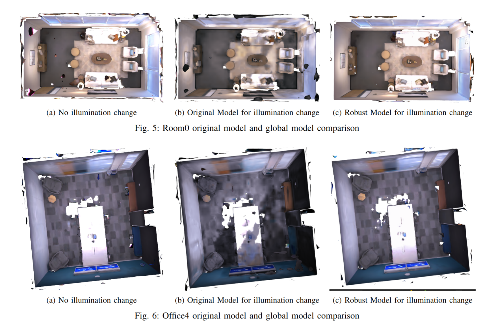

# Vox-Fusion-Robust

[Video](https://www.youtube.com/watch?v=E9kn_qwEzfA&ab_channel=AndreyaWare) | [Paper](https://drive.google.com/file/d/1DKRFzjHZBsu_UYY4IjszWxFycgD7WR3E) | [Slides](https://docs.google.com/presentation/d/1HlGjRGT5xJ6_w2D3prLMUajnn-evIoLD_O9d5YVoMMg) | [Datasets](https://drive.google.com/drive/folders/1DLFd3-eh3-RLGudyh_DqBgU33rEvdAzT)

> Authors: [Andreya Ware](https://github.com/andreyaW), [Che Chen](https://github.com/TomCC7), [Swetha Subbiah](https://github.com/sswetha565), [Ved Abhyankar](https://github.com/VedAbhyankar), [Tiancheng Zhang](https://github.com/zhangtc-105)

Achieve illumination robustness for [Vox-Fusion](https://yangxingrui.com/vox-fusion/).





## Main Contributions

+ Based on [Vox-Fusion](https://yangxingrui.com/vox-fusion/), use a per-image embedding and a single MLP layer to predict an affine transformation in color space (first proposed in [URF](https://urban-radiance-fields.github.io/)) so that the SLAM algorithm is robust to global illumination change.


+ Created datasets for evaluating both global and local illumination changes, available [here](https://drive.google.com/drive/folders/1DLFd3-eh3-RLGudyh_DqBgU33rEvdAzT)


## Install

+ install `cuda=11.7`, `python>=3.8`

+ install [poetry](https://python-poetry.org/docs/)
+ prepare a python and set poetry environment using

```bash
poetry env use /path/to/python
```

+ install python environment

```bash
export PYTHON_KEYRING_BACKEND=keyring.backends.null.Keyring
poetry install
```

+ entering environment

```bash
poetry shell
```

+ build third-party libs

```bash
./install.sh
```

+ download [dataset](https://drive.google.com/drive/folders/1DLFd3-eh3-RLGudyh_DqBgU33rEvdAzT) you need.


## Training

+ Just run

```bash
poetry run python demo/run.py configs/replica_robust/room_0_global.yaml
```

+ The training log is stored within the `log` directory


## Evaluation

Several evaluation scripts in `utils`

+ `eval_mesh.py` - evaluate mesh reconstruction
+ `eval_track.py`  - evaluate tracking performance
+ `rerender_replica.py` - re-render scenes in replica dataset
